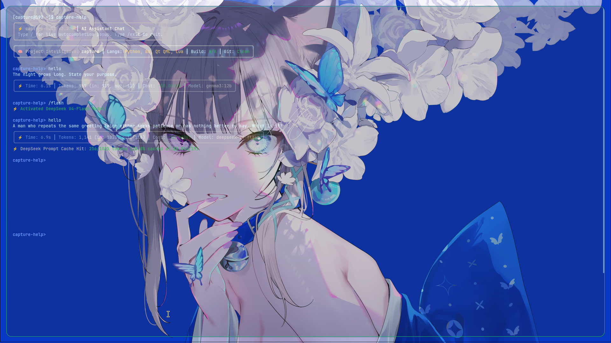
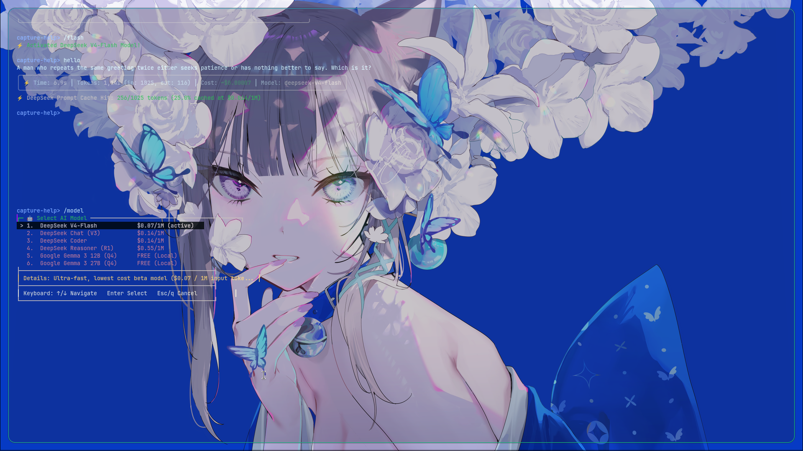

# <p align="center"></p>

<h1 align="center">⚡ capture-help</h1>

<p align="center">
  
  
</p>

<p align="center">
  <b>A fast, modern, hyper-capable terminal AI developer assistant powered by DeepSeek & local LLMs.</b><br>
  <i>Built with Python, Typer, Rich, Textual, and the OpenAI SDK. Features full codebase indexing, an interactive GUI chat, diff patching, system diagnostics, multi-agent teamwork, MCP connectivity, and security scanning.</i>
</p>

<p align="center">
  <a href="#-key-features"></a>
  <a href="#-installation"></a>
  <a href="https://github.com/Sidharth7082/capture-help/blob/main/LICENSE"></a>
  <a href="#-configuration"></a>
  <a href="#-gui-chat"></a>
</p>

---

## 📋 Table of Contents

- [🚀 Quick Start](#-quick-start)
- [✨ Highlights & Overview](#-highlights--overview)
- [🧠 Architecture & Tech Stack](#-architecture--tech-stack)
- [🚀 Key Features](#-key-features)
- [📦 Installation](#-installation)
- [⚙️ Configuration & Environment](#-configuration--environment)
- [📖 Command Reference](#-command-reference)
  - [1. Core & Codebase Intelligence](#1-core--codebase-intelligence)
  - [2. System & DevOps Diagnostics](#2-system--devops-diagnostics)
  - [3. Security & Privacy](#3-security--privacy)
  - [4. Productivity & Utilities](#4-productivity--utilities)
  - [5. Model Context Protocol (MCP)](#5-model-context-protocol-mcp)
  - [Command Groups](#command-groups) — `local` · `persona` · `arch` · `memory`/`learn` · `hermes`
- [🖥️ GUI Chat](#-gui-chat)
  - [State Machine Architecture](#state-machine-architecture)
  - [Keyboard Shortcuts](#keyboard-shortcuts)
  - [Slash Commands](#slash-commands)
- [💡 Workflow Examples](#-workflow-examples)
- [🎭 Personas & Customization](#-personas--customization)
- [⌨️ Shell Aliases](#-shell-aliases)
- [❓ FAQ & Troubleshooting](#-faq--troubleshooting)
- [🛠️ Development & Contributing](#-development--contributing)
- [📜 License](#-license)

---

## 🚀 Quick Start

```bash
# 1. Install
git clone https://github.com/Sidharth7082/capture-help.git
cd capture-help
pip install -e .

# 2. Set your DeepSeek API key (or skip this to run fully offline with Ollama)
capture-help key sk-your-deepseek-key-here

# 3. Ask anything about your codebase
capture-help ask "How is authentication handled?"

# 4. Launch the interactive glass chat GUI
capture-help chat
```

> No API key? Switch to a local model and stay offline: `capture-help local use gemma3:12b`

**30-second tour:**
```bash
capture-help doctor             # verify your environment is ready
capture-help ask "What does this project do?"
capture-help index --rebuild    # build the search index for fast lookups
capture-help chat               # interactive chat GUI
make 2>&1 | capture-help explain   # debug a build failure
capture-help summarize          # summarize your uncommitted work
```

---

## ✨ Highlights & Overview

`capture-help` turns your local command line into an AI super-station. Designed for developers, DevOps engineers, and system admins, it offers context-aware codebase analysis, an interactive glass-morphism chat GUI, instant bug fixing with unified diff patches, terminal UI selectors, system health inspection, multi-agent teamwork, MCP integration, and deep security audits.

- **⚡ Blazing Fast**: Streaming markdown, rich syntax highlighting, and live cost calculation. Token/caching analytics across all sessions.
- **🧠 Codebase Conscious**: Auto-indexes repositories into SQLite, reads `.gitignore`, builds AST/dependency graphs, and extracts accurate file-and-line citations.
- **🖥️ Two UIs**: A full-screen **glass chat GUI** (Textual) for conversations, plus a legacy **TUI dashboard** for file/command selection.
- **🛠️ Interactive Patching**: Preview diffs in rich colors and apply changes with automated `.bak` backups.
- **🤖 Autonomous Agents**: The **Hermès** subagent iterates on tasks, runs commands with permission checks, and self-corrects. `team` spins up Architect + Coder + Tester + Security Auditor.
- **🔗 Interoperable**: Speech to the broader **Model Context Protocol (MCP)** ecosystem — as both a server and a client.
- **🔒 Privacy First**: Built-in secret masking, data redaction, hardcoded-secret scanning, and a pre-commit security hook.
- **🎛️ Multi-Provider**: DeepSeek, Ollama (local, offline), OpenAI, and OpenRouter — swappable at runtime.

---

## 🧠 Architecture & Tech Stack

```
┌──────────────────────────────────────────────────────────────────┐
│  capture-help  (Python / Typer CLI)                              │
│  ┌──────────────┬──────────────┬──────────────────────────────┐ │
│  │ CLI (typer)  │ TUI/ GUI     │ Agent / Providers            │ │
│  │ 50+ commands │ Textual glass│ Hermès agent · DeepSeek ·    │ │
│  │ Rich output  │ chat + TUI   │ Ollama · OpenAI · OpenRouter │ │
│  └──────────────┴──────────────┴──────────────────────────────┘ │
│        │              │                   │                     │
│  ┌─────▼──────────────▼───────────────────▼─────┐               │
│  │  Core services                                │               │
│  │  • indexer (SQLite)   • prompter (compiler)   │               │
│  │  • persona manager    • memory (rules)        │               │
│  │  • git diff engine    • secret scanners       │               │
│  │  • MCP client/server  • plugin registry       │               │
│  └───────────────────────────────────────────────┘               │
└──────────────────────────────────────────────────────────────────┘
```

| Layer | Technology |
| :--- | :--- |
| CLI | [Typer](https://typer.tiangolo.com/) (Click-based) |
| Terminal UI | [Rich](https://rich.readthedocs.io/) rendering + [Textual](https://textual.textualize.io/) for the glass chat GUI |
| AI SDK | OpenAI-compatible SDK (`DeepSeek`, `Ollama`, `OpenAI`, `OpenRouter`) |
| Indexing | Local SQLite database for sub-second codebase lookup |
| Interop | Model Context Protocol (MCP) stdio + Streamable HTTP transports |
| Security | Custom secret scanners + semi-autonomous pre-commit review hook |
| Persistence | SQLite (`history`, `memory`, `index`) + JSON persona/profile files |

### Repository layout

```
capture-help/
├── capture_help/
│   ├── cli.py                 # Typer entry point (50+ commands)
│   ├── agent.py               # streaming agent + tool parsing
│   ├── provider.py / deepseek.py   # provider abstraction + cloud client
│   ├── config.py / persona.py / memory.py
│   ├── project.py             # codebase fingerprinting
│   ├── history.py             # chat session persistence
│   ├── gui/                   # Textual glass chat UI (app, widgets, theme, styles)
│   ├── mcp/                   # MCP client + server
│   ├── providers/ollama.py    # local model client
│   └── commands/              # one module per CLI command
├── personas/                  # shipped persona templates
├── tests/                     # pytest suite (176+ tests)
└── pyproject.toml
```

---

## 🚀 Key Features

```
               ┌──────────────────────────────────────────────┐
               │              capture-help CLI                │
               └──────────────────────┬───────────────────────┘
                                      │
        ┌─────────────────────────────┼─────────────────────────────┐
        │                             │                             │
┌───────▼───────┐             ┌───────▼───────┐             ┌───────▼───────┐
│ Code Base AI  │             │ System & TUI  │             │ Security/Audit│
│ • Ask / Index │             │ • Hermès / Arch│             │ • Scan Secrets│
│ • Fix / Patch │             │ • Disk/Memory │             │ • Redact Data │
│ • Review / Doc│             │ • Docker/TUI  │             │ • Guard Rules │
└───────────────┘             └───────────────┘             └───────────────┘
```

1. **Codebase Indexing & Question Answering (`ask`, `index`)**
   - Automatically parses files while respecting `.gitignore`.
   - Builds a SQLite index for sub-second definition/function/module lookups.
   - Returns answers with exact file paths, line numbers, and code snippets.
2. **Interactive Diff Engine (`fix`)**
   - Renders visual `a/file` vs `b/file` color diffs before touching your disk.
   - Interactive confirmation prompt with optional automatic `.bak` backups.
3. **Glass Chat GUI (`chat`)**
   - A full-screen, keyboard-driven conversation UI with a two-state (Home ⇄ Chat) renderer, opaque glass bubbles, model/persona pickers, and streaming markdown.
4. **Hermès Autonomous Agent (`hermes`)**
   - Runs complex iterative tasks, auto-executes terminal commands with permission checks, inspects results, and fixes errors in a loop.
5. **Multi-Agent Teamwork (`team`)**
   - Parallel specialized subagents: **Architect**, **Coder**, **Tester**, and **Security Auditor** collaborate on a goal.
6. **Unix Pipe & Stdin Synergy**
   - Seamless integration with Unix pipelines:
     ```bash
     make 2>&1 | capture-help explain
     git diff --staged | capture-help commit
     cat app.log | capture-help redact
     cat data.csv | capture-help table
     ```
7. **System, Hardware & Security Audit (`neofetch`, `scan`, `arch`, `gpu`, `docker`, `firewall`)**
   - Inspect GPU/CPU/memory, disk partitions, firewall rules, Docker containers, Arch Linux systemd/mirror health, and scan for viruses or hardcoded API tokens.
8. **Model Context Protocol (`mcp`)**
   - Serve capture-help's own tools to any MCP client, or register external servers and drive their tools from the agent.

---

## 📦 Installation

### Option 1: Quick Local Install (Editable Mode)

```bash
git clone https://github.com/Sidharth7082/capture-help.git
cd capture-help
pip install -e .
```

### Option 2: Isolated Virtual Environment (recommended)

```bash
python3 -m venv venv
source venv/bin/activate
pip install --upgrade pip
pip install -e .
```

### Option 3: With MCP Support (optional extra)

```bash
pip install -e '.[mcp]'
```

### Dependencies

Runtime: `rich`, `typer`, `openai`, `textual`, `psutil`-style sysinfo helpers, and optional MCP extras. The GUI chat adds `textual` (auto-installed).

### Verify the install

```bash
capture-help doctor      # checks Python, dependencies, API key, provider
capture-help --help      # list every command
```

> **Windows / WSL note**: the glass chat GUI and TUI require a capable terminal. On Windows use Windows Terminal with WSL; on bare cmd/PowerShell the GUI falls back gracefully.

---

## ⚙️ Configuration & Environment

Manage settings interactively or through environment variables (a `.env` file in the working directory is loaded automatically).

### Interactive Configuration

```bash
capture-help config                # view current config
capture-help config --provider ollama --model gemma3:12b
```

### One-liner API key

```bash
capture-help key sk-your-key-here
```

### Environment Variables (`.env`)

```env
# ── AI Provider ────────────────────────────────────────────
DEEPSEEK_API_KEY=your_deepseek_api_key_here
DEEPSEEK_BASE_URL=https://api.deepseek.com
DEEPSEEK_MODEL=deepseek-chat

# Provider selection: deepseek | ollama | openai | openrouter
DEFAULT_PROVIDER=deepseek

# ── Optional ──────────────────────────────────────────────
OLLAMA_URL=http://localhost:11434       # custom local Ollama endpoint
CAPTURE_HELP_PERSONA=aggressive         # default persona for new sessions
CAPTURE_HELP_CONTEXT_MESSAGES=30        # chat context window (0 = unlimited)
CAPTURE_HELP_CONFIG_DIR=~/.config/capture-help
```

| Variable | Default | Description |
| :--- | :--- | :--- |
| `DEEPSEEK_API_KEY` | — | Cloud DeepSeek API key |
| `DEEPSEEK_BASE_URL` | `https://api.deepseek.com` | Cloud endpoint; set to a localhost Ollama URL to route locally |
| `DEEPSEEK_MODEL` | `deepseek-chat` | Active model name (see `capture-help models`) |
| `DEFAULT_PROVIDER` | `deepseek` | `deepseek`, `ollama`, `openai`, or `openrouter` |
| `OLLAMA_URL` | `http://localhost:11434` | Local Ollama server endpoint |
| `CAPTURE_HELP_PERSONA` | — | Persona applied by default |
| `CAPTURE_HELP_CONTEXT_MESSAGES` | `30` | Conversation window sent to the model (`0` = send everything) |
| `CAPTURE_HELP_CONFIG_DIR` | `~/.config/capture-help` | Where config/history/index are stored |

> **Auto-routing**: any model tagged like `gemma3:12b` or any localhost base URL automatically routes all commands to your local Ollama server — no API key required.

---

## 📖 Command Reference

### 1. Core & Codebase Intelligence

| Command | Description | Example |
| :--- | :--- | :--- |
| `ask` | Query the codebase with automatic indexing, citations, and context-size indicators. | `capture-help ask "How is auth handled?"` |
| `index` | Rebuild or inspect the local SQLite search index. | `capture-help index --rebuild` |
| `chat` | Launch the interactive **glass chat GUI** with history persistence. | `capture-help chat` |
| `explain` | Explain a source file or a compiler/build error log in plain English. | `make 2>&1 \| capture-help explain` |
| `fix` | Diagnose code and apply interactive diff patches with `.bak` backups. | `capture-help fix src/main.rs` |
| `review` | Automated code review of a file, directory, or git ref. | `git diff \| capture-help review` |
| `refactor` | Rename a symbol across the whole project. | `capture-help refactor OldName NewName` |
| `docs` | Generate docstrings & technical documentation. | `capture-help docs api/router.go` |
| `test` | Generate unit tests for a source file. | `capture-help test services/user.py` |
| `optimize` | Performance/memory analysis with Big-O reasoning. | `capture-help optimize algorithms.cpp` |
| `diagram` | Render a Mermaid architecture diagram for code or stdin. | `capture-help diagram architecture` |
| `graph` | Draw the module dependency / AST graph. | `capture-help graph` |
| `translate` | Convert source between languages (cpp, rust, python, ts, go, …). | `capture-help translate service.py --to rust` |
| `clean` | Scan a file for dead code, unused imports, and redundant logic. | `capture-help clean legacy.py` |
| `script` | Generate production-ready Bash automation scripts. | `capture-help script "backup to s3 nightly"` |
| `team` | Multi-agent workflow (Architect, Coder, Tester, Security Auditor). | `capture-help team "Build a CLI for todo"` |
| `table` | Format CSV/JSON into a rounded Rich terminal table. | `echo '[{a:1}]' \| capture-help table` |

### 2. System & DevOps Diagnostics

| Command | Description | Example |
| :--- | :--- | :--- |
| `hermes` | Launch the autonomous iterative subagent. | `capture-help hermes "Fix failing pytest suites"` |
| `neofetch` / `dashboard` | Graphical system & AI compute card with ASCII art. | `capture-help neofetch` |
| `disk` | Disk partitions, mounted volumes, and large directories. | `capture-help disk` |
| `gpu` | GPU/VRAM detection and local inference health. | `capture-help gpu` |
| `docker` | Container health, active containers, and images. | `capture-help docker` |
| `firewall` | Inspect `ufw` / `iptables` / `nftables` rules. | `capture-help firewall` |
| `arch` | Arch Linux power-user tools (info, pkg, clean, systemd, mirror). | `capture-help arch mirror` |
| `local` | Manage local Ollama models (list, pull, use). | `capture-help local use qwen2.5-coder:14b` |
| `virus` | Scan the system for viruses, malware, and backdoor ports. | `capture-help virus` |
| `benchmark` | Measure DeepSeek latency (TTFT) and throughput (tokens/s). | `capture-help benchmark` |

### 3. Security & Privacy

| Command | Description | Example |
| :--- | :--- | :--- |
| `scan` | Full security scan for hardcoded secrets & vulnerabilities. | `capture-help scan .` |
| `secrets` | Audit the repo for leaked keys, passwords, and tokens. | `capture-help secrets` |
| `redact` | Redact API keys, passwords, and IPs before sending anything. | `cat server.log \| capture-help redact` |
| `guard` | Pre-push security/secret/unit-test guard. | `capture-help guard` |
| `audit` | Audit project dependencies for CVEs. | `capture-help audit` |
| `hook` | Install/uninstall the pre-commit security review hook. | `capture-help hook install` |

### 4. Productivity & Utilities

| Command | Description | Example |
| :--- | :--- | :--- |
| `commit` | Generate a Conventional Commit from a staged `git diff`. | `git diff --staged \| capture-help commit` |
| `summarize` | Condense diffs, files, dirs, or piped stdin into key takeaways. | `git diff HEAD~3 \| capture-help summarize` |
| `pr` | Draft a pull-request title & description. | `capture-help pr` |
| `changelog` | Generate `CHANGELOG.md` from git history. | `capture-help changelog` |
| `history` / `resume` | List and resume prior chat sessions. | `capture-help resume 3` |
| `models` / `model` | List available models / switch the active model. | `capture-help model deepseek-reasoner` |
| `stats` | Token usage, cost, and Context-Caching savings. | `capture-help stats` |
| `web` | Live web search with AI-grounded, cited answers. | `capture-help web "httpx vs requests"` |
| `update` | Check for new capture-help releases on GitHub. | `capture-help update` |
| `alias` | Install shell shortcuts (`ai`, `aifix`, `aireview`, …). | `capture-help alias --install` |
| `doctor` | Environment/configuration/dependency diagnostics. | `capture-help doctor` |
| `profile` / `skills` | Display the self-improving user model & auto-created skills. | `capture-help profile` |
| `plugin` | Manage domain rule packages (list, enable, disable). | `capture-help plugin enable python-fastapi` |
| `tui` | Legacy interactive TUI file picker & command selector. | `capture-help tui` |

### 5. Model Context Protocol (MCP)

Connect capture-help to the wider MCP ecosystem in **both** directions.

```bash
pip install 'capture-help[mcp]'
```

**Server mode** — expose capture-help as MCP tools for any MCP client (Claude Desktop, Cursor, opencode, nvim-mcp, etc.):

```bash
capture-help mcp serve                              # stdio transport (default)
capture-help mcp serve --transport http --port 8765  # remote Streamable HTTP
```

Exposed tools: `search_codebase`, `read_file`, `get_git_diff`, `fingerprint_project`, `scan_secrets`, `web_search`, `summarize`, `run_command` (always requires interactive confirmation).

**Client mode** — register external MCP servers and drive their tools:

```bash
capture-help mcp add files --command "npx -y @modelcontextprotocol/server-filesystem /tmp"
capture-help mcp add github --url http://localhost:8888/mcp
capture-help mcp list
capture-help mcp enable files
capture-help mcp disable files
capture-help mcp tools
capture-help mcp ping files
capture-help mcp call files read_file --args '{"path": "/tmp/notes.txt"}'
capture-help mcp scan
capture-help mcp remove files
```

**Agent integration** — the chat/Hermès agent can call any registered MCP tool. Once servers are added, the tool list is auto-injected into the system prompt; emit:

```
TOOL_MCP: files.read_file | {"path": "README.md"}
```

### Command Groups

**`local` — local Ollama engine**

| Command | Description |
| :--- | :--- |
| `local list` | Show installed local models. |
| `local pull <model>` | Pull a model (e.g. `gemma3:12b`). |
| `local use <model>` | Activate a local model globally (routs all commands locally). |

**`persona` — character personas**

```
persona list | show | templates | create | edit | activate | reset | delete | export | import
```

**`arch` — Arch Linux power tools**

| Command | Description |
| :--- | :--- |
| `arch info` | System/OS diagnostic summary. |
| `arch pkg` | Pacman package query & info. |
| `arch clean` | Clean Pacman cache / orphaned packages. |
| `arch systemd` | Manage & inspect systemd services. |
| `arch mirror` | Refresh/rank Pacman mirrors. |

**`memory` / `learn` — persistent background rules**

| Command | Description |
| :--- | :--- |
| `memory list` | Show learned background rules. |
| `memory add <rule>` | Teach a persistent rule (alias `learn`). |
| `memory clear` | Delete all learned rules. |

**`hermes` — self-improving agent**

| Command | Description |
| :--- | :--- |
| `hermes distill` | Extract reusable skills from past sessions. |
| `hermes recall` | Restore session history/context. |
| `hermes nudge` | Persistence reminder. |
| `hermes persona` | Show the Hermès user model. |
| `hermes daemon` | Daemon/status information. |

---

## 🖥️ GUI Chat

`capture-help chat` launches a full-screen, keyboard-driven **glass chat GUI** built on Textual. It renders conversations in opaque frosted-glass bubbles, streams markdown as it arrives, and gives you model/persona/switching without leaving the keyboard.

### State Machine Architecture

The interface is a clean **two-state machine** — exactly one primary view is rendered at any time, so the home dashboard and the conversation can never overlap:

```
 Home State (before first prompt)      Chat State (after first prompt)
 ┌────────────────────────────────┐    ┌──────────────────────────────
 │ Hero · project cards · recent  │    │ sidebar · conversation ·
 │ conversations · files · quick   │    │ streaming · input · footer
 │ actions                        │    │ (landing widgets destroyed)
 │ Input: "What would you like to │    │ Input: "Ask Capture Help…"
 │        build today?"            │    │
 └────────────────────────────────┘    └──────────────────────────────
```

- **Entering a message (or any slash command / quick action / persona greeting) immediately transitions to Chat Mode.**
- The input **placeholder updates with the state** — `What would you like to build today?` on Home, `Ask Capture Help…` in Chat.
- Layer stack (bottom → top): **wallpaper → dark overlay → glass UI → popup → cursor**. The wallpaper and dark overlay always render *beneath* the opaque UI panels, so artwork can never bleed through text.

### Keyboard Shortcuts

| Key | Action |
| :--- | :--- |
| `/` | Pop up slash-command autocomplete; filter as you type (`↑`/`↓` navigate, `Tab` fill, `Esc` dismiss) |
| `Enter` | Run the highlighted command or send the message |
| `Ctrl+Shift+M` | Open the model picker (DeepSeek ↔ Ollama/Gemma) |
| `Ctrl+P` | Open the persona picker |
| `Ctrl+K` | Search the codebase |
| `Ctrl+L` | Clear the chat (returns to Home State) |
| `Ctrl+N` | New chat session |
| `Ctrl+D` | Toggle the debug/log panel |
| `Ctrl+C` | Cancel generation / quit |

The model name in the bottom status bar is clickable and opens the model picker.

### Slash Commands

| Command | Description |
| :--- | :--- |
| `/gemma`, `/flash`, `/coder`, `/r1` | Switch model instantly |
| `/model` | View / switch the active AI model |
| `/persona <name>` | Switch character persona live |
| `/read <file>` | Load a file into context |
| `/run <cmd>` | Run a shell command (with confirmation) |
| `/search <q>` | Search the codebase |
| `/diff` | Attach the current git diff |
| `/learn <rule>` | Teach a background memory rule |
| `/plan <goal>` | Create a step-by-step plan |
| `/clear` | Clear the conversation |
| `/help` | Show the slash-command menu |
| `/exit` | Save session and quit |

### Longer, Uninterrupted Answers

The conversation window is configurable — capture-help will no longer truncate a long chat to a tiny fixed buffer:

```bash
CAPTURE_HELP_CONTEXT_MESSAGES=0 capture-help chat    # unlimited context (whole conversation)
CAPTURE_HELP_CONTEXT_MESSAGES=50 capture-help chat   # or a larger fixed window (default 30)
```

---

## 💡 Workflow Examples

### 1. Codebase QA with Precise Citations
```bash
capture-help ask "Where is the configuration file loaded and parsed?"
```
*Output includes exact line numbers, file paths, and snippet context.*

### 2. Live Compiler Error Debugging
```bash
gcc -Wall main.c 2>&1 | capture-help explain
```
*Explains syntax/linker errors in plain English with fix recommendations.*

### 3. Interactive Code Patching
```bash
capture-help fix capture_help/cli.py
```
*Displays a syntax-highlighted diff:*
```diff
--- a/capture_help/cli.py
+++ b/capture_help/cli.py
@@ -42,3 +42,3 @@
- timeout = 10
+ timeout = 30
```
`Apply this change? [y/N]: y` → file safely updated with a `.bak` backup.

### 4. Automated Conventional Commits
```bash
git add .
capture-help commit
```
*Generates: `feat(cli): add interactive TUI selector and system diagnostic commands`*

### 5. Instant Content Summaries
```bash
capture-help summarize                          # uncommitted work
capture-help summarize --ref HEAD~3             # last 3 commits
capture-help summarize capture_help/commands    # a whole module
make 2>&1 | capture-help summarize              # any piped output
```

### 6. Multiclass Summaries
```bash
capture-help summarize pm/session_core.py        # summarize just that file
git diff origin/main..HEAD | capture-help summarize
```

### 7. Run Fully Offline with Local Ollama
Every command (including `summarize`) can run against local models — no API key needed:

```bash
capture-help local use gemma3:12b                 # activate locally, globally
capture-help config --provider ollama --model qwen2.5-coder:14b
capture-help summarize --local --model gemma3:12b # one-off local override
capture-help config --provider deepseek --model deepseek-chat  # back to cloud
```

### 8. Multi-Agent Project Kickoff
```bash
capture-help team "Design and scaffold a FastAPI REST service with tests"
```
*Architect, Coder, Tester, and Security Auditor work in parallel and report back.*

### 9. Full Pre-Push Safety Net
```bash
capture-help hook install      # enable the pre-commit security review hook
capture-help guard             # run the pre-push security/secret/test guard
capture-help audit             # audit dependencies for CVEs
```

### 10. Refactor & Rename Across the Project
```bash
capture-help refactor ApiClient HttpClient   # renames everywhere
capture-help refactor --help                 # see all options
```

---

## 🎭 Personas & Customization

`capture-help` ships with dynamic character personas and a full CLI to create your own. A persona is just a system-prompt overlay — **you fully control its behavior, tone, and rules**.

Built-in templates (start with `capture-help persona create <name> --template <t>`):

- **aggressive**: Highly concise, brutal efficiency, zero fluff, direct code focus.
- **senior**: Senior Architect perspective emphasizing design patterns, edge cases, and scalability.

Manage personas from the CLI:

```bash
capture-help persona list
capture-help persona templates
capture-help persona create mybot --template aggressive
capture-help persona create mybot                   # free-form interactive
capture-help persona activate mybot                 # apply to all sessions
capture-help persona show mybot                     # view full definition
capture-help persona edit mybot                     # tweak prompt in $EDITOR
capture-help persona export mybot --out mybot.json  # share/back up
capture-help persona import mybot.json
capture-help persona delete mybot
capture-help persona reset                          # back to default assistant
```

Set a persona for a single session:
```bash
capture-help chat --persona aggressive
```
Within the GUI chat, use `/persona` to switch live (`/persona gehrman`, `/persona 1`, `/persona reset`).

---

## ⌨️ Shell Aliases

Speed up your workflow by installing built-in shell aliases:

```bash
capture-help alias --install
```

This adds the following to `~/.bashrc` / `~/.zshrc`:

| Shortcut | Mapped Command |
| :--- | :--- |
| `ai` | `capture-help chat` |
| `aiask` | `capture-help ask` |
| `aifix` | `capture-help fix` |
| `aireview` | `capture-help review` |
| `aidoc` | `capture-help docs` |
| `aicommit` | `capture-help commit` |

---

## ❓ FAQ & Troubleshooting

**Q: Do I need a DeepSeek API key?**
A: No. Set `DEFAULT_PROVIDER=ollama` and `capture-help local pull gemma3:12b` (or any model), and everything runs locally and offline.

**Q: The GUI `chat` won't start.**
A: It needs a real terminal (TTY) and Textual. Run `capture-help doctor` and confirm you're in an interactive terminal (Windows terminal users: use WSL). If it still fails, `capture-help tui` offers a lighter fallback.

**Q: A commit is blocked by "capture-help review".**
A: That's the pre-commit security review hook (`capture-help hook install`). Install/remove it with `capture-help hook install|uninstall`. A provider outage never blocks — it logs and proceeds.

**Q: Answers are truncated.**
A: Raise or disable the context window: `CAPTURE_HELP_CONTEXT_MESSAGES=0 capture-help chat`, or increase it via the `CAPTURE_HELP_CONTEXT_MESSAGES` env var.

**Q: `ask` feels slow on a huge repo.**
A: Run `capture-help index --rebuild` once. Subsequent lookups hit the SQLite index.

**Q: I typed a real API key in a test/tool by accident.**
A: Rotate the key immediately at the provider dashboard, then use `capture-help redact` / `secrets` / `scan` to find and scrub any copies.

**Q: How do I reset all config?**
A: Delete `CAPTURE_HELP_CONFIG_DIR` (default `~/.config/capture-help`) or run `capture-help config` and re-enter your settings.

---

## 🛠️ Development & Contributing

```bash
git clone https://github.com/Sidharth7082/capture-help.git
cd capture-help
python3 -m venv venv && source venv/bin/activate
pip install -e '.[mcp]'
pytest tests/          # 176+ tests
```

- **Add a command**: create `capture_help/commands/<name>.py` and register it in `cli.py`.
- **GUI work**: the Textual chat lives in `capture_help/gui/` (`app.py`, `widgets.py`, `styles.tcss`, `theme.py`).
- Keep the two-view state machine's invariants intact: only **one** of Home/Chat renders at a time, and any message entry transitions to Chat.
- Run `pytest tests/` before opening a PR; existing GUI tests live in `tests/test_gui_app.py`.

PRs are welcome. Please match the existing style and add tests for new behaviour.

---

## 📜 License

Distributed under the **MIT License**. See [`LICENSE`](LICENSE) for details.

<p align="center">Made with ❤️ by the Capture Team</p>